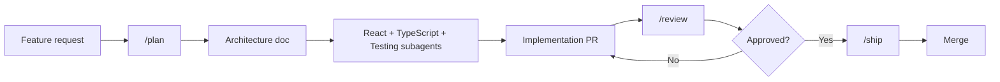

# TCSgon

> Enterprise-grade React 18+ SPA. Strict TypeScript. Vite. Redux Toolkit. React Query.
> Built for maintainability, scalability, performance, security, and accessibility — day one.

---

## Purpose

TCSgon is a **production-ready React 18+ SPA** plus a **multi-agent AI system** that enforces enterprise engineering standards automatically.

**The application.** A scalable, type-safe, accessible foundation for long-lived React apps — Vite, strict TypeScript, React Query, Redux Toolkit (only when justified), React Hook Form + Zod, MSW. Hard gates on lint, typecheck, coverage (80% lines / 75% branches / 80% functions), bundle size (200/350 kB gzip per route), and axe-core (zero critical/serious) make quality non-negotiable.

**The agent system.** Nine specialist agents — *architecture, react, typescript, testing, performance, accessibility, code-review, documentation, ai-workflow* — wired into five CLI tools (opencode, Cursor, Claude Code, Codex CLI, Gemini CLI). They plan features (`/plan`), review PRs (`/review`), and gate merges (`/ship`). `.opencode/` is the single source of truth every tool reads.

**Who it's for.** Teams building internal tools, B2B dashboards, or any React app where *maintainability, security, and accessibility* outrank day-one velocity. Use TCSgon as a starting point, or adopt just the agent system on an existing codebase.

## Quick start

**Prerequisites:** Node **>=24** (v24 "Krypton" LTS — see [`.nvmrc`](./.nvmrc)) and **pnpm >=10** (Corepack will pin via `packageManager`).

```bash
pnpm install         # 562 packages, ~22s
pnpm dev             # Vite HMR dev server on :5173
pnpm lint            # ESLint (flat config)
pnpm lint:fix        # auto-fix safe issues
pnpm typecheck       # tsc --noEmit (strict + noUncheckedIndexedAccess)
pnpm test            # Vitest (watch mode)
pnpm test:run        # Vitest (single run)
pnpm test:coverage   # coverage gates: 80 / 75 / 80
pnpm build           # production build (tsc -b + vite build)
pnpm build:analyze   # same + bundle visualizer → dist/stats.html
pnpm preview         # preview production build on :4173
pnpm e2e             # Playwright E2E (chromium)
pnpm axe             # a11y-only spec via @axe-core/playwright
pnpm clean           # remove dist/, coverage/, playwright-report/, test-results/
```

> **Current status (all completed phases):** every gate passes. Coverage: **96.7% lines / 90.34% branches / 87.34% functions** (gates: 80%/75%/80%). **762 client tests across 107 files**. Auth feature: 100% all metrics. No `any`, no `@ts-ignore`, no `eslint-disable` without justification. See [`docs/plans/phase-1-core-infrastructure.md`](./docs/plans/phase-1-core-infrastructure.md) and [`roadmap.md`](./roadmap.md) for full plans + verification logs.

---

## Milestones

### Phase 0 — Project Scaffold ✅

Complete. Repo skeleton with strict TypeScript, Vite, ESLint, Vitest, Playwright, all CI gates passing.

---

### Phase 1 — Core Infrastructure ✅ (merged)

Authentication, routing, API layer, state management, and shared UI components.

| Area | Delivered |
|------|-----------|
| **Auth** | `useAuth` hook with Zod-validated responses, `AuthState` discriminated union (4 variants), Redux slice + persistence middleware, `RequireAuth` three-state guard, `RedirectIfAuth`, `LoginPage`/`LoginForm`/`ProfileMenu` |
| **API client** | `createApiClient` with typed requests, Zod schema validation, configurable retry, correlation IDs, timeout, `ApiClientContext` for dependency injection |
| **Routing** | `createAppRouter` with lazy-loaded routes, `RootErrorBoundary` (render crashes), `RouteErrorElement` (loader/action errors), `RouteFallback` (hydration), breadcrumb resolution |
| **State** | Redux store with `authSlice` and `uiSlice` (theme, sidebar, toasts, modals, reducedMotion), middleware for persistence + action logging |
| **UI components** | `Spinner`, `Skeleton`, `Toast`/`ToastRegion` (dual live-region pattern), `SkipLink`, `Sidebar`, `TopBar`, `AppShell`, `AuthLayout` |
| **Hooks** | `useTheme` (system preference + localStorage sync, no-flash), `usePrefersReducedMotion` (`useLayoutEffect` + `matchMedia`), `useToast` |
| **Types** | Branded IDs (`SessionId`, `UserId`), `ApiError` with 6-variant discriminated payload, Zod `SessionSchema` |
| **Accessibility** | WCAG 2.2 AA: semantic HTML, focus management on route errors, `aria-live` regions, skip link, reduced-motion support, color contrast ≥ 3:1 |
| **Testing** | 250+ tests across 35+ files, 97.86% lines / 87.33% branches / 90.43% functions, MSW-free integration tests, React Testing Library behavioral assertions |
| **Docs** | ADR 0001: token persistence strategy, remediation plan for code review, full coverage suite |

See [`docs/plans/phase-1-core-infrastructure.md`](./docs/plans/phase-1-core-infrastructure.md) for the full plan and [`docs/adr/0001-token-persistence-strategy.md`](./docs/adr/0001-token-persistence-strategy.md) for architecture decisions.

---

### Phase 2 — Design System Primitives ✅ (partial — core shell components)

Reusable, accessible, typed UI primitives used by the shell and auth features. Each ships with RTL tests and axe audit.

| Component | Status | Notes |
|-----------|--------|-------|
| `Spinner` | ✅ | SVG animation, `aria-label`, respects `prefers-reduced-motion` |
| `Skeleton` | ✅ | Shimmer placeholder, light/dark tokens |
| `Toast` / `ToastRegion` | ✅ | Dual live-region pattern (polite/assertive), stacked, auto-dismiss, pause on hover, `prefers-reduced-motion` |
| `SkipLink` | ✅ | First focusable element, visible on focus |
| `Sidebar` | ✅ | Collapsible, keyboard nav, `aria-expanded`, focus trap on mobile |
| `TopBar` | ✅ | Self-contained auth via `useAuth()`, renders `ProfileMenu` or sign-in link |
| `AppShell` | ✅ | Responsive shell (sidebar + top bar + main), integrates `SessionCheck` |
| `AuthLayout` | ✅ | Consistent heading + subheading for auth pages |
| **Button, Input, Select, Checkbox, Badge, Avatar** | ✅ | Primitives: accessible, typed, tested — `Button` (href-discriminant `<a>`/`<button>`), `Input` (`forwardRef` + `useId()`), `Select`, `Checkbox` (indeterminate support), `Badge` (6 variant colors, 3 sizes), `Avatar` (image → initials → SVG fallback) |
| **Modal, Drawer, Tooltip, DataTable, Pagination, Tabs, Radio.Group, ErrorBoundary, ConfirmDialog, EmptyState, ErrorDisplay** | ✅ | Existing composites hardened with full tests + a11y audits (see Phase 7) |

---

### Phase 3 — Authentication Feature (Full-Stack) ✅

Complete end-to-end authentication: backend API + database, frontend pages, full-stack integration, E2E tests, and hardening.

#### 3a — Backend Auth API + Database ✅ (Express + Prisma + PostgreSQL)

| Area | Delivered |
|------|-----------|
| **Database** | PostgreSQL on `:5242`, Prisma schema: `users`, `sessions`, `password_reset_tokens` (plus reserved `projects` model) |
| **Crypto** | SHA-256 token hashing, bcrypt password hashing (`bcryptjs` for Windows compat) |
| **Auth middleware** | `requireAuth` (Bearer token → session lookup), `validate(schema)` (Zod body validation), global error handler (structured JSON) |
| **Auth routes** | `POST /signup`, `POST /login`, `POST /logout`, `POST /forgot-password`, `POST /reset-password`, `GET /session` |
| **User routes** | `GET /users/me`, `PUT /users/me`, `PUT /users/me/password` |
| **Testing** | 65 tests across 7 files (service, middleware, route integration), dedicated `tcsgon_test` DB, sequential execution, factory utilities |

#### 3b — Frontend Auth Pages ✅ (React + Redux + React Query)

| Page / Feature | Delivered |
|----------------|-----------|
| **LoginPage** | Email + password, validation, error display, redirect on success, auto-focus, loading state |
| **SignupPage** | Name + email + password + confirm, `PasswordStrengthIndicator` (`role="meter"`), auto-login on success |
| **ForgotPasswordPage** | Email-only form, success confirmation view (no Redux state changes) |
| **ResetPasswordPage** | Token from URL params, new password + confirm, success auto-login |
| **ProfileMenu** | Avatar/initials dropdown: name, email, Settings link, Sign Out; full keyboard support, ARIA menu pattern |
| **Auth guards** | `RequireAuth` (redirects to login), `RedirectIfAuth` (redirects to dashboard), `SessionCheck` (rehydrates on mount) |
| **API hooks** | `useLogin`, `useSignup`, `useLogout`, `useResetPassword`, `useSession` — React Query + Redux dispatch on success/error |

#### 3c — Full-Stack Integration + E2E + Hardening ✅

| Area | Delivered |
|------|-----------|
| **E2E tests** | 20 auth tests (login, signup, logout, session, forgot/reset password, error flows, edge cases) |
| **Mock API** | `mockApi.ts` with configurable `MockApiOptions` (`authenticated`, `authError`, `authNetworkError`) |
| **A11y audits** | 8 axe-core tests (dashboard, login, signup, forgot, reset valid/missing token, settings) — zero violations |
| **Coverage** | Auth feature: **100% lines / 100% branches / 100% functions** (48 new unit tests for previously uncovered components/pages) |
| **Critical bug fix** | `getToken` resolver wired in `main.tsx` — Authorization header now sent on all authenticated requests |
| **Lint** | Zero errors, zero warnings (25 fixed across client + server) |
| **Bundle** | All route bundles within 200/350 kB gzip budget |

See [`docs/plans/phase-3-authentication.md`](./docs/plans/phase-3-authentication.md) for the full plan.

---

### Phase 4 — Projects Feature (Dashboard + CRUD) 🔄 (partially delivered)

| Area | Status |
|------|--------|
| **DashboardPage** | ✅ Stat cards, recent activity list, skeleton loading, error retry |
| **ProjectListPage** | ✅ Table with sort, pagination, filter, empty state, create CTA |
| **ProjectDetailPage** | ✅ Full project view with edit navigation |
| **ProjectCreatePage** | ✅ Form with validation, creates project, navigates to detail |
| **ProjectEditPage** | ✅ Loads current values, saves changes |
| **API hooks** | ✅ `useProjects`, `useProject`, `useCreateProject`, `useUpdateProject` (React Query + Zod) |
| **Backend endpoints** | 🔄 Not yet implemented — frontend currently hits 404s (Phase 3a reserved `projects` model) |

---

### Phase 5 — Settings Feature ✅

> All review findings remediated. See `docs/plans/phase-5-settings.md`.

- [x] Profile settings (name, email, avatar) with avatar preview + initials fallback
- [x] Password change (current + new + confirm)
- [x] Notification preferences — 5 toggle switches with individual mutations
- [ ] Theme preference persistence (already in `uiSlice`) — _not yet started_

**Code review remediations (16/16 complete):**
- [x] B1 — Brand `userId` as `UserId` type
- [x] B2/B3 — `aria-describedby` on all 5 notification toggles
- [x] B4 — Error summary contrast (4.42:1 → 5.8:1)
- [x] B5 — Unchecked toggle contrast (1.48:1 → 4.8:1)
- [x] B6 — Controlled `checked` (no more `defaultChecked`)
- [x] M1 — Removed dead `defaultValues`, added `useMemo`
- [x] M2 — Safe `instanceof` narrowing for image error handlers
- [x] M3 — Avatar `onError` uses React state, not DOM manipulation
- [x] M4/S1 — Single parameterized toggle handler, removed double refetch
- [x] S2 — Removed redundant re-exports
- [x] S3 — Error state for notification preferences section
- [x] S4 — Fixed stale JSDoc
- [x] S5 — Added 5 new tests (avatar URL, avatar error, notification toggles)
- [x] S6 — Renamed Prisma relation `notificationPref` → `notificationPreferences`

---

### Phase 6 — Testing & A11y Hardening ✅

Coverage push, accessibility audit, edge case hardening. See [`docs/plans/phase-6-testing-a11y-hardening.md`](./docs/plans/phase-6-testing-a11y-hardening.md).

| Area | Delivered |
|------|-----------|
| **Coverage** | 96.1% lines / 87.65% branches / 85.76% functions. 501 tests across 76 files. All gates pass. |
| **Shared component tests** | All 10 shared components have render + interaction + edge case + a11y tests. 14 `*.axe.test.tsx` files with zero violations. |
| **API hook tests** | Every hook: success, error (401/409/422/500), network-failure, loading. 36+ tests across `authApi` and `userApi`. |
| **Page integration tests** | All pages covered: DashboardPage (6), SettingsPage (16), ProjectListPage (8), ProjectCreatePage (4), LoginPage, SignupPage, etc. Error boundary tests on every page. |
| **Automated a11y** | axe-core in CI (unit via jest-axe + E2E via @axe-core/playwright). 16/16 E2E a11y tests pass on Chromium + mobile. Zero critical/serious. |
| **Keyboard audit** | 14/14 E2E keyboard tests pass. Focus-trap detection, skip-link verification, expanded selector coverage. |
| **Edge case registry** | `docs/edge-cases/registry.json` — 69 entries across auth/dashboard/projects/shared. Zod-validated, CI-gated. |
| **Lighthouse CI** | 3 routes (/, /dashboard, /settings). Performance ≥ 0.9, accessibility = 1.0, CWV error assertions. |
| **Bundle budgets** | Max JS chunk 63.47 kB gzip (budget 200/350 kB). Max CSS 2.23 kB (budget 30/60 kB). Zero test dep leaks into production. |
| **CI workflow** | E2E sharded 4×, Playwright browser caching, dedicated a11y job, bundle budget gate, edge case validation, Lighthouse CI enabled. |

> **Note:** The design system primitives originally deferred from Phase 6 were delivered in Phase 7 (Design System Completion).

See [`docs/plans/phase-6-testing-a11y-hardening.md`](./docs/plans/phase-6-testing-a11y-hardening.md) for the full plan and edge case documentation.

---

### Phase 7 — Design System Completion + Landing Page ✅

> Six new primitives, six hardened composites, a11y audits for all, feature page adoption, and a public landing page. See [`docs/plans/phase-7-design-system-and-features.md`](./docs/plans/phase-7-design-system-and-features.md).

| Area | Delivered |
|------|-----------|
| **Button** | Accessible `<button>` / `<a>` (href-presence discriminant), 6 color variants, 3 sizes, loading spinner, `forwardRef` |
| **Input** | Wrapper with label/error/hint, `forwardRef` + `useId()`, 3 sizes, `fullWidth` |
| **Select** | Mirrors Input API, native `<select>` for a11y, 3 sizes, placeholder option |
| **Checkbox** | Controlled + indeterminate (`useEffect` DOM property), label association, error state |
| **Badge** | 6 variant colors, 3 sizes, dot + count modes, CSS-only animation, respects `prefers-reduced-motion` |
| **Avatar** | Image → initials → SVG fallback chain, `key={src}` for src-change resets, 4 sizes, aria-label |
| **Modal / Drawer / Tabs / Tooltip / Radio.Group / ErrorBoundary** | 6 composites hardened: 82 new tests (unit + a11y), focus management, keyboard support, role semantics |
| **Existing a11y tests (5 components)** | EmptyState, ErrorDisplay, DataTable, Pagination, ConfirmDialog — 29 new axe-core tests added |
| **Feature page adoption** | Input/Select/Badge/Avatar adopted across 12 feature files (projects, dashboard, auth ProfileMenu, settings) |
| **Landing Page** | Public homepage at `/` with hero, feature cards, CTAs; redirects authenticated users to `/dashboard` via `<Navigate>`; WCAG 2.2 AA clean |
| **Type correctness** | All `exactOptionalPropertyTypes` violations resolved (`| undefined` on optional props); zero `!` on CSS module dot-access |
| **CI fixes** | 36 unsafe `!` assertions removed; E2E locator updated for new Avatar component |

---

### Phase 8 — Performance Optimization 📋

> Measure, identify, optimize, verify. See [`roadmap.md`](./roadmap.md#phase-7--performance-optimization).

- [ ] Lighthouse baseline + CWV targets (LCP < 2.5s, INP < 200ms, CLS < 0.1)
- [ ] Route-level code splitting audit + bundle analysis (200 kB warn / 350 kB error)
- [ ] Image optimization (AVIF/WebP, responsive srcset, lazy loading)
- [ ] List virtualization (`@tanstack/react-virtual` for lists > 50 rows)
- [ ] Memoization only where measured (no preemptive `React.memo`)
- [ ] Lighthouse CI in GitHub Actions (fail on regression)

---

### Phase 9 — CI/CD & Deployment Pipeline 📋

> Automated quality gates, preview deployments, production release. See [`roadmap.md`](./roadmap.md#phase-8--cicd--deployment-pipeline).

- [ ] PR workflow: lint → typecheck → test (coverage) → build (budget) → axe → e2e → Lighthouse CI
- [ ] Server CI: `cd server && pnpm test` against test DB
- [ ] Main branch: version bump + CHANGELOG + staging deploy
- [ ] Preview deployment per PR (comment with URL)
- [ ] Production deployment on merge to main

---

### Phase 10 — Documentation & Knowledge Base 📋

- [ ] ADRs for all architectural decisions (state, routing, TS strict, design system)
- [ ] Feature author conventions (`src/features/__README__.md`)
- [ ] Design system usage guide (`src/shared/components/__README__.md`)
- [ ] Runbook (`docs/runbook.md`), onboarding guide (`docs/onboarding.md`)
- [ ] JSDoc on every exported symbol, CHANGELOG per release

---

## Stack

| Layer | Choice |
|---|---|
| **Framework** | React 18+ (functional components, hooks) |
| **Language** | TypeScript (strict, `noUncheckedIndexedAccess`, `exactOptionalPropertyTypes`) |
| **Bundler** | Vite with React plugin + code splitting |
| **Global state** | Redux Toolkit (only when justified across 3+ feature trees) |
| **Server state** | React Query (TanStack Query v5) |
| **Routing** | React Router v6 (lazy routes) |
| **Forms** | React Hook Form + Zod schemas |
| **Unit / integration** | Vitest + React Testing Library |
| **E2E** | Playwright |
| **Network mocking** | MSW v2 |
| **A11y audit** | `@axe-core/playwright` (Deque official, chainable `AxeBuilder` API) |
| **Bundle analysis** | Vite rollup-plugin-visualizer |
| **Package manager** | pnpm |

---

## Engineering standards

All rules are codified in [`AGENTS.md`](./AGENTS.md) and enforced by the agent system. Highlights:

- **No `any`.** No `@ts-ignore` without a ticket. Strict mode enforced at build.
- **State order:** local → Context → React Query → Redux Toolkit. No Redux without written justification.
- **Functional components + hooks only.** No class components, no HOCs.
- **`useEffect` for side effects only.** Never for derived state — compute during render.
- **Accessibility:** WCAG 2.2 AA minimum. Semantic HTML first. Keyboard, contrast, motion.
- **Performance:** Route bundles ≤ 200 kB warn / 350 kB error (gzip). LCP < 2.5s. INP < 200ms. CLS < 0.1.
- **Testing:** Behavior, not implementation. 80% lines / 75% branches / 80% functions. Regression test per bug fix.
- **Security:** CSP enforced. No secrets in source. No `dangerouslySetInnerHTML` without justification.

---

## Agent system

Nine specialist AI agents are wired into every supported tool. Use `/plan` for new features, `/review` for PRs, `/ship` for pre-merge checks.

They cluster into **three systems** by role:

### 1. Planning & orchestration

Owns *how work gets decomposed and delegated*. Only `primary` agents the user picks directly.

| Agent | Mode | Role |
|---|---|---|
| `ai-workflow` | primary | Orchestrator. Plans features, dispatches steps to subagents, critiques outputs, integrates results, runs final gates. |
| `code-review` | primary | Read-only reviewer. Applies the AGENTS.md §6 checklist and blocks unsafe merges. |

### 2. Domain specialist subagents

Owned by `ai-workflow` / `code-review`. Each is the canonical authority for its slice of engineering. `architecture` is user-selectable but acts as a planner (edit=deny, bash=deny) — it hands off to the others, never executes.

| Agent | Mode | Owns |
|---|---|---|
| `architecture` | primary (planner) | Folder structure, module boundaries, state decisions, dependency direction, interfaces, risks |
| `react` | subagent | Components, hooks, composition, state ordering (local → Context → React Query → Redux) |
| `typescript` | subagent | Strict types, interfaces, discriminated unions, branded IDs, Zod schemas |
| `testing` | subagent | Vitest + RTL + MSW + Playwright. Behavior assertions, 80/75/80 coverage, regression tests |
| `performance` | subagent | Bundle budgets (200/350 kB gzip), Core Web Vitals (LCP < 2.5s, INP < 200ms, CLS < 0.1), measured optimizations only |
| `accessibility` | subagent | WCAG 2.2 AA, semantic HTML, keyboard, focus, contrast, motion preferences, axe-core |
| `documentation` | subagent | JSDoc, ADRs, READMEs, CHANGELOG entries, Storybook stories |

### 3. Tool wiring layer

The **delivery surface** — the same nine agents available across five CLIs. `.opencode/` is the single source of truth; the others are thin adapters.

| Tool | Config dir | Mechanism |
|---|---|---|
| **opencode** | `.opencode/` | `opencode.json` + `prompts/agents/*.txt` + `agents/*.md` + `skills/*/SKILL.md` (canonical) |
| **Cursor** | `.cursor/` | `rules/*.mdc` (alwaysApply) + `agents/*.md` subagents |
| **Claude Code** | `.claude/` | `CLAUDE.md` + `agents/*.md` subagents |
| **Codex CLI** | `.codex/` | `config.toml` agent registry + `agents/*.md` |
| **Gemini CLI** | `.gemini/` | `settings.json` agents + `commands/*.toml` |

### How they connect

```
User → /plan → ai-workflow
                  ├─ architecture (plan)
                  ├─ react        (component shape)
                  ├─ typescript   (type contracts)
                  ├─ testing      (verification surface)
                  ├─ accessibility (a11y contract)
                  └─ performance   (budget impact)
        → /review → code-review
                  ├─ typescript / react / a11y / perf (deep checks)
                  └─ documentation (doc gaps)
        → /ship   → ai-workflow (DoD gates: lint, typecheck, tests, axe, build)
```

**Primary** agents are user-selectable. **Subagents** are invoked by primary agents at runtime.

### Commands

| Command | Agent | What it does |
|---|---|---|
| `/plan <feature>` | ai-workflow | Full feature plan: architecture → react → typescript → testing → a11y → perf |
| `/review <pr-url>` | code-review | PR review: checklist + type + react + a11y + perf checks |
| `/ship` | ai-workflow | DoD gate: lint, typecheck, test, build, axe, docs, approvals |

---

## Per-tool wiring

| Tool | Config | Agent mechanism |
|---|---|---|
| **opencode** | `.opencode/` | `agent.*` definitions + `prompts/agents/*.txt` + `agents/*.md` + `skills/*/SKILL.md` |
| **Cursor** | `.cursor/` | `rules/*.mdc` (alwaysApply) + `agents/*.md` subagents |
| **Claude Code** | `.claude/` | `CLAUDE.md` + `agents/*.md` subagents |
| **Codex CLI** | `.codex/` | `config.toml` agent registry + `agents/*.md` |
| **Gemini CLI** | `.gemini/` | `settings.json` agents + `commands/*.toml` |

All tools reference `.opencode/` as the single source of truth for agent specs.

---

## Project layout

```
TCSgon/
├── AGENTS.md                     # Immutable engineering rules
├── SKILLS.md                     # Procedural skill index
├── README.md                     # You are here
├── roadmap.md                    # Phased delivery plan
├── .opencode/                    # opencode config (canonical agent source)
│   ├── opencode.json             # 9 agent definitions + MCP + providers
│   ├── prompts/agents/           # System prompt files (9)
│   ├── agents/                   # Canonical agent spec docs (9)
│   ├── skills/                   # Procedural workflows (6)
│   └── commands/                 # Slash commands (3)
├── .cursor/                      # Cursor rules + agents + MCP
├── .claude/                      # Claude Code CLAUDE.md + agents
├── .codex/                       # Codex CLI config + agents
├── .gemini/                      # Gemini CLI settings + commands + agents
├── src/                          # Application source
│   ├── main.tsx                  # App entry: Redux + ApiClientProvider + RouterProvider
│   ├── App.tsx                   # RootErrorBoundary wrapping createAppRouter
│   ├── routes/                   # Router config, guards, error boundaries
│   │   ├── index.tsx             # createAppRouter, RouteObject definitions
│   │   ├── lazy.ts               # Lazy-loading utility
│   │   ├── RequireAuth.tsx       # Three-state auth guard (Outlet / Spinner / redirect)
│   │   ├── RedirectIfAuth.tsx    # Redirect authed users away from /login
│   │   ├── RootErrorBoundary.tsx # Class-based error boundary (render crash catch)
│   │   ├── ErrorBoundaryFallback.tsx  # Error UI extracted from boundary
│   │   ├── RouteErrorElement.tsx # Route loader/action error display
│   │   ├── RouteFallback.tsx     # Hydration fallback (Spinner)
│   │   ├── breadcrumbs.ts        # Route handle crumb resolution
│   │   └── *_test.*              # Tests for each module
│   ├── features/                 # Feature-sliced modules
│   │   └── auth/                 # Authentication feature
│   │       ├── authState.ts      # Discriminated union: anonymous / authenticating / authenticated / error
│   │       ├── authState.test.ts
│   │       ├── slice/            # Redux slice + persistence middleware
│   │       │   ├── authSlice.ts
│   │       │   ├── authPersistence.ts
│   │       │   └── *_test.*
│   │       ├── hooks/
│   │       │   ├── useAuth.ts    # Login / logout / refresh + Zod validation
│   │       │   └── useAuth.test.tsx  # 25 tests, 100% coverage
│   │       ├── components/
│   │       │   ├── LoginForm.tsx / LoginForm.module.css
│   │       │   ├── ProfileMenu.tsx / ProfileMenu.module.css
│   │       │   └── *_test.*
│   │       └── pages/
│   │           ├── LoginPage.tsx / LoginPage.test.tsx
│   │           ├── DashboardPage.tsx / DashboardPage.test.tsx
│   │           ├── NotFoundPage.tsx / NotFoundPage.test.tsx
│   │           ├── SettingsPage.tsx / SettingsPage.test.tsx
│   │           └── index.ts
│   ├── shared/                   # Shared infrastructure
│   │   ├── api/                  # API client, Context, errors, schemas, queryClient
│   │   │   ├── client.ts / client.test.ts       # Typed fetch with retry, validation, correlation IDs
│   │   │   ├── ApiClientContext.tsx / test      # DI context for client instance
│   │   │   ├── errors.ts / errors.test.ts       # ApiError with discriminated payload
│   │   │   ├── schemas.ts / schemas.test.ts     # Zod schemas (SessionSchema)
│   │   │   └── queryClient.ts / test
│   │   ├── components/           # Shared UI: Spinner, Skeleton, Toast, ToastRegion
│   │   │   ├── Spinner.tsx / Spinner.module.css
│   │   │   ├── Skeleton.tsx / Skeleton.module.css
│   │   │   ├── Toast.tsx / Toast.module.css
│   │   │   ├── ToastRegion.tsx / ToastRegion.module.css
│   │   │   └── *_test.*
│   │   ├── hooks/                # Shared hooks: useTheme, useToast, usePrefersReducedMotion
│   │   │   ├── useTheme.ts / test
│   │   │   ├── useToast.ts / test
│   │   │   ├── usePrefersReducedMotion.ts / test
│   │   │   └── index.ts
│   │   └── types/                # Branded IDs, user types, Toast/Modal types
│   │       ├── brand.ts / brand.test.ts    # Branded type pattern (SessionId, UserId)
│   │       ├── user.ts
│   │       └── index.ts
│   ├── store/                    # Redux store configuration
│   │   ├── index.ts              # configureStore with middleware
│   │   ├── hooks.ts              # useAppSelector / useAppDispatch
│   │   ├── middleware.ts / test  # authPersistence + logging middleware
│   │   └── slices/
│   │       ├── uiSlice.ts / test # Theme, sidebar, toasts, modals, reducedMotion
│   │       └── *_test.*
│   ├── styles/
│   │   └── tokens.css            # CSS custom properties (light + dark)
│   └── layouts/                  # Layout components
│       ├── AppShell.tsx / AppShell.module.css / test
│       ├── AuthLayout.tsx / AuthLayout.module.css
│       ├── Sidebar.tsx / Sidebar.module.css / test
│       ├── TopBar.tsx / TopBar.module.css / test
│       └── SkipLink.tsx / SkipLink.module.css / test
├── e2e/                          # Playwright tests
├── public/
├── docs/                         # ADRs, plans, audits
├── vitest.config.ts
├── vite.config.ts
├── tsconfig.json
├── tsconfig.node.json
├── eslint.config.js
├── playwright.config.ts
└── package.json
```

---

## Working agreements

1. **Plan before code** — any change touching > 3 files starts with `/plan`.
2. **Validate AI output** — typecheck, lint, and test every generated function.
3. **Cite `file:line`** — every review, critique, or issue must reference exact locations.
4. **Hand off** — let the owning specialist agent own its domain; don't cross boundaries.
5. **No secrets in source** — tokens, keys, and credentials stay out of version control.
6. **No `any`** — never. Use `unknown` + narrowing or a proper type.
7. **No `@ts-ignore`** — without a linked ticket explaining why.
8. **Bug fix = regression test** — every fix ships with a test that fails before the fix.

---

## Contributor workflow



---

## Learning more

- `AGENTS.md` — the full immutable rule set every agent follows
- `SKILLS.md` — procedural skill index with delegation flow
- `roadmap.md` — phased delivery plan for the entire application
- `.opencode/agents/*.md` — detailed canonical specs for each agent