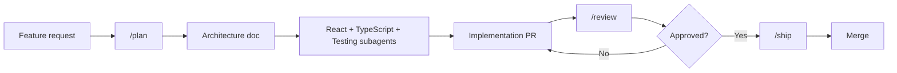

# TCSgon

> Enterprise-grade React 18+ SPA. Strict TypeScript. Vite. Redux Toolkit. React Query.
> Built for maintainability, scalability, performance, security, and accessibility — day one.

---

## Quick start

```bash
pnpm install
pnpm dev              # Vite HMR dev server
pnpm lint             # ESLint (flat config)
pnpm typecheck        # tsc --noEmit (strict mode)
pnpm test             # Vitest + RTL
pnpm test --coverage  # coverage gates: 80/75/80
pnpm build            # production build + bundle analysis
pnpm preview          # preview production build
pnpm axe              # aXe-core a11y audit (CI gate)
pnpm e2e              # Playwright E2E
```

---

## Stack

| Layer | Choice |
|---|---|
| **Framework** | React 18+ (functional components, hooks) |
| **Language** | TypeScript (strict, `noUncheckedIndexedAccess`, `exactOptionalPropertyTypes`) |
| **Bundler** | Vite with React plugin + code splitting |
| **Global state** | Redux Toolkit (only when justified across 3+ feature trees) |
| **Server state** | React Query (TanStack Query v5) |
| **Routing** | React Router v6 (lazy routes) |
| **Forms** | React Hook Form + Zod schemas |
| **Unit / integration** | Vitest + React Testing Library |
| **E2E** | Playwright |
| **Network mocking** | MSW v2 |
| **A11y audit** | axe-core (CI gate, zero serious/critical) |
| **Bundle analysis** | Vite rollup-plugin-visualizer |
| **Package manager** | pnpm |

---

## Engineering standards

All rules are codified in [`AGENTS.md`](./AGENTS.md) and enforced by the agent system. Highlights:

- **No `any`.** No `@ts-ignore` without a ticket. Strict mode enforced at build.
- **State order:** local → Context → React Query → Redux Toolkit. No Redux without written justification.
- **Functional components + hooks only.** No class components, no HOCs.
- **`useEffect` for side effects only.** Never for derived state — compute during render.
- **Accessibility:** WCAG 2.2 AA minimum. Semantic HTML first. Keyboard, contrast, motion.
- **Performance:** Route bundles ≤ 200 kB warn / 350 kB error (gzip). LCP < 2.5s. INP < 200ms. CLS < 0.1.
- **Testing:** Behavior, not implementation. 80% lines / 75% branches / 80% functions. Regression test per bug fix.
- **Security:** CSP enforced. No secrets in source. No `dangerouslySetInnerHTML` without justification.

---

## Agent system

Nine specialist AI agents are wired into every supported tool. Use `/plan` for new features, `/review` for PRs, `/ship` for pre-merge checks.

| Agent | Mode | Purpose |
|---|---|---|
| `architecture` | primary | Project structure, module boundaries, state decisions |
| `react` | subagent | Components, hooks, rendering, composition |
| `typescript` | subagent | Types, interfaces, generics, strictness |
| `testing` | subagent | Unit, integration, E2E, coverage |
| `performance` | subagent | Profiling, bundle, Core Web Vitals |
| `accessibility` | subagent | WCAG 2.2 AA, ARIA, keyboard, motion |
| `code-review` | primary | Validates human- and AI-generated code |
| `documentation` | subagent | API docs, ADRs, changelogs, JSDoc |
| `ai-workflow` | primary | Plans tasks, delegates to subagents, critiques, integrates |

**Primary** agents are user-selectable. **Subagents** are invoked by primary agents at runtime.

### Commands

| Command | Agent | What it does |
|---|---|---|
| `/plan <feature>` | ai-workflow | Full feature plan: architecture → react → typescript → testing → a11y → perf |
| `/review <pr-url>` | code-review | PR review: checklist + type + react + a11y + perf checks |
| `/ship` | ai-workflow | DoD gate: lint, typecheck, test, build, axe, docs, approvals |

---

## Per-tool wiring

| Tool | Config | Agent mechanism |
|---|---|---|
| **opencode** | `.opencode/` | `agent.*` definitions + `prompts/agents/*.txt` + `agents/*.md` + `skills/*/SKILL.md` |
| **Cursor** | `.cursor/` | `rules/*.mdc` (alwaysApply) + `agents/*.md` subagents |
| **Claude Code** | `.claude/` | `CLAUDE.md` + `agents/*.md` subagents |
| **Codex CLI** | `.codex/` | `config.toml` agent registry + `agents/*.md` |
| **Gemini CLI** | `.gemini/` | `settings.json` agents + `commands/*.toml` |

All tools reference `.opencode/` as the single source of truth for agent specs.

---

## Project layout

```
TCSgon/
├── AGENTS.md                     # Immutable engineering rules
├── SKILLS.md                     # Procedural skill index
├── README.md                     # You are here
├── roadmap.md                    # Phased delivery plan
├── .opencode/                    # opencode config (canonical agent source)
│   ├── opencode.json             # 9 agent definitions + MCP + providers
│   ├── prompts/agents/           # System prompt files (9)
│   ├── agents/                   # Canonical agent spec docs (9)
│   ├── skills/                   # Procedural workflows (6)
│   └── commands/                 # Slash commands (3)
├── .cursor/                      # Cursor rules + agents + MCP
├── .claude/                      # Claude Code CLAUDE.md + agents
├── .codex/                       # Codex CLI config + agents
├── .gemini/                      # Gemini CLI settings + commands + agents
├── src/                          # Application source (see roadmap)
│   ├── main.tsx
│   ├── App.tsx
│   ├── routes/
│   ├── features/
│   ├── shared/
│   ├── api/
│   └── __tests__/
├── e2e/                          # Playwright tests
├── public/
├── docs/                         # ADRs, plans, audits
├── vitest.config.ts
├── vite.config.ts
├── tsconfig.json
├── tsconfig.node.json
├── eslint.config.js
├── playwright.config.ts
└── package.json
```

---

## Working agreements

1. **Plan before code** — any change touching > 3 files starts with `/plan`.
2. **Validate AI output** — typecheck, lint, and test every generated function.
3. **Cite `file:line`** — every review, critique, or issue must reference exact locations.
4. **Hand off** — let the owning specialist agent own its domain; don't cross boundaries.
5. **No secrets in source** — tokens, keys, and credentials stay out of version control.
6. **No `any`** — never. Use `unknown` + narrowing or a proper type.
7. **No `@ts-ignore`** — without a linked ticket explaining why.
8. **Bug fix = regression test** — every fix ships with a test that fails before the fix.

---

## Contributor workflow



---

## Learning more

- `AGENTS.md` — the full immutable rule set every agent follows
- `SKILLS.md` — procedural skill index with delegation flow
- `roadmap.md` — phased delivery plan for the entire application
- `.opencode/agents/*.md` — detailed canonical specs for each agent